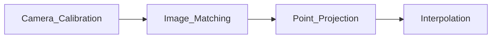

## Built-in Camera Configurations

| Scanner Model | Camera Count | Camera Position | Image Resolution | Point Density Info | Angle Resolution | Software | Notes |
| :-----------: | :----------: | :--------------:| :---------------: | :-----------------:| :---------------:| :-------:| :----:|
| **Faro Focus3D S350** | 1 | Co-axial with laser | 3264×2448 px (per image), up to 867 MPx (raw) | – | – | Faro Scene | – |
| **Faro Focus3D X330** | 1 | Co-axial with laser | Up to 70 MPx | – | – | Faro Scene | – |
| **Leica BLK360** | 3 | On one side | 2592×1944 px, up to 150 MPx | – | 4.04×10⁻⁴ rad | Cyclone REGISTER 360, Cyclone | 3 flash lights |
| **Leica P50 / P40** | 1 | Co-axial with laser | 1920×1920 px, up to 700 MPx | – | 1.55×10⁻⁴ rad | Cyclone REGISTER 360, Cyclone | External camera supported |
| **Leica RTC360** | 3 | On one side | 4000×3000 px, up to 432 MPx | – | ~2.75×10⁻⁴ rad | Cyclone REGISTER 360, Cyclone | Full dome HDR capture |
| **Z+F 5016** | 1 | Opposite rotating mirror | Up to 80 MPx | – | – | Z+F LaserControl | 4 LED lights, HDR i-Cam |
| **Riegl VZ-4000** | – | – | – | – | – | RiSCAN PRO | See official specs |

## Methods to Generate Colored Point Clouds

### Standard Workflow

1. **Camera Calibration**
   - Use intrinsic parameters of internal or external camera(s).

2. **Image Matching**
   - Create panoramic images or spherical projections.

3. **3D–2D Projection**
   - Use extrinsic parameters to project point cloud onto images.

4. **Color Interpolation**
   - Assign RGB to 3D points using nearest pixel or interpolation.

### Challenges

- Parallax error (especially with external cameras)
- Misalignment in handheld/mobile scans

## Scanner-Specific Details

### Faro Focus3D X330

- Co-axial camera minimizes parallax.
- Uses SCENE software for automatic colorization.
- Scanner rotates 180°, but camera rotates 360°.

### Leica BLK360

- Uses 3 cameras (10 photos each) to generate full panorama.
- Produces 360° × 300° image coverage.
- Supports HDR and LDR imaging.
- Integrated IR (thermal) camera.
- Minimum scanning range: **0.6 m**.

### Leica P50 / P40

- Internal camera resolution: up to 700 MPx (HDR mode).
- Supports mounting of DSLR cameras (e.g., Canon EOS 60D–90D).
- HDR capture support.

### Leica RTC360

- Integrated **VIS system** (Visual-Inertial Odometry) for trajectory tracking.
- Captures 36 HDR images (3 × 12 configuration).
- Panoramic resolution: up to 432 MPx (raw), ~200 MPx usable after mapping.
- Minimum scanning range: **0.5 m**.

### Z+F 5016

- Built-in **HDR i-Cam**: 80 MPx, supports up to 11 exposures.
- Colorized scan capture in approx. 3 minutes.
- Integrated 4 × LED (700 lumens).
- Supports external **T-Cam** (thermal).
- Software features:
  - Camera model selection
  - Internal/external camera calibration
  - Color mapping & camera registration
  - Direct scan colorization

### Riegl VZ-4000

- Long-range scanner.
- Camera configuration not public; refer to official specs:
  - [Riegl VZ-4000 Product Page](http://www.riegl.com/nc/products/terrestrial-scanning/produktdetail/product/scanner/30/)

## References

- Leica ScanStation P50/P40/P30 System Field Manual v6.0  
- [Evaluating the Quality of TLS Point Cloud Colorization – *Remote Sensing*, 2020](https://www.mdpi.com/2072-4292/12/17/2748)  
- [HDR Imaging – *Towards Data Science*](https://towardsdatascience.com/hdr-imaging-what-is-an-hdr-image-anyway-bdf05985492c)  
- [Laser Scanning Forum – Camera & Wavelength Discussion](https://mail.laserscanningforum.com/forum/viewtopic.php?t=8817)  
- [Z+F 5016 Specs (PDF)](https://positics.fr/wp-content/uploads/2020/07/5016-Spec-techniques.pdf)  
- [Z+F Tutorial & Manual](https://gmv.cast.uark.edu/scanning/)